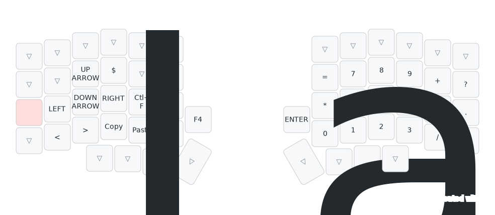
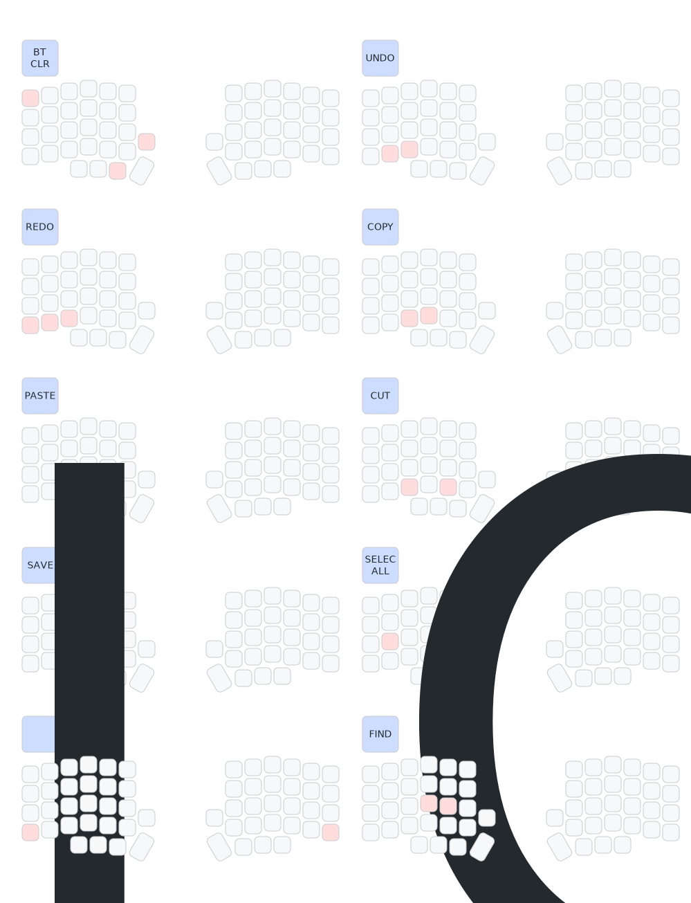

# Lily58 Keymap Configuration

  This repository contains the ZMK configuration for the Lily58 keyboard. Below are the layers configured along with their corresponding keymap images.

## Keymap Layers Overview

### 1. Default Layer

  

The Default Layer is the base layer of the keyboard. It includes the standard alphanumeric keys along with essential modifiers like Shift, Control, and Alt.

### 2. Raise Layer

  

The Raise Layer is activated by holding the Raise key. This layer provides access to function keys, symbols, and additional navigation controls.

### 3. cl_Layer

  

The cl_Layer is a custom layer that offers additional functionality like media controls, system commands, and other specialized inputs.

### 4. Conf Layer

  

The Conf Layer provides configuration options for Bluetooth management, power control, and more advanced settings.

### 5. Combos Overview

  

Combos allow you to trigger specific actions by pressing multiple keys simultaneously. Below is an overview of the available combos.

### 6. Combos View

  

This view gives a detailed illustration of how the combos are configured and can be utilized for various shortcuts and commands.

## How to Use
To use this keymap configuration, clone the repository and flash the appropriate firmware onto your Lily58 keyboard. Ensure that you have the necessary ZMK setup to apply these configurations.

For any issues or questions, feel free to open an issue or contribute to the repository.

  <a href="https://github.com/your-username/your-repository/issues">Report an Issue</a> |
  <a href="https://github.com/your-username/your-repository/pulls">Contribute</a>

